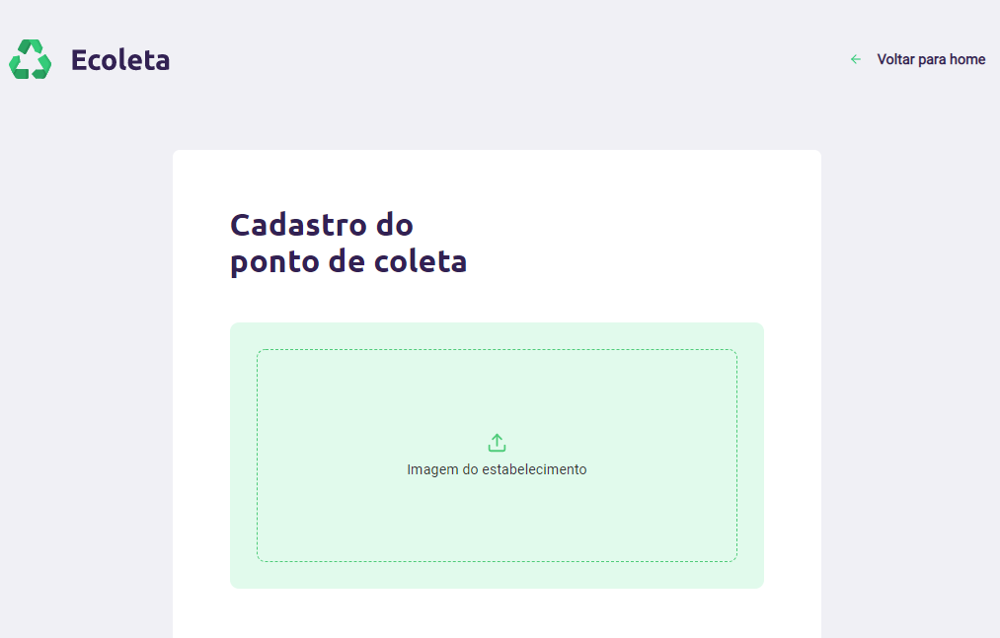
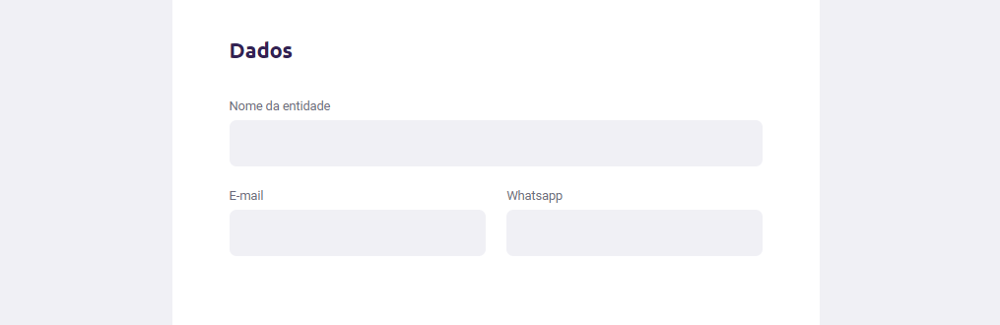
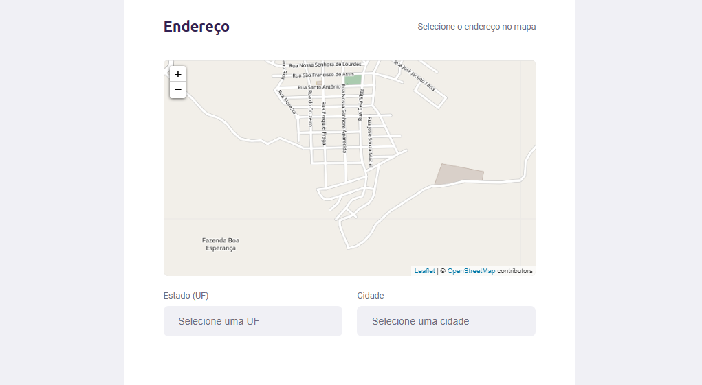

# Projeto Ecoleta

Com a ajuda da Next Level Week #1, este projeto foi criado com o objetivo de estudar as tecnologias mais utilizadas do mercado e criar uma aplicação que tem o objetivo de melhorar a coleta de resíduos em sua cidade. Entidades podem criar pontos de coleta de determinados tipos de resíduos e as pessoas podem utilizar o aplicativo mobile para encontrar ou entrar em contato com essas entidades.

## Tecnologias

- Typescript
- Node.js/Express.js
- React
- React Native
- SQLite

## Home | Web

## Cadastro do Ponto de Coleta | Web

## Home | Mobile

## Pontos de Coleta | Mobile

## Detalhes do Ponto de Coleta | Mobile

